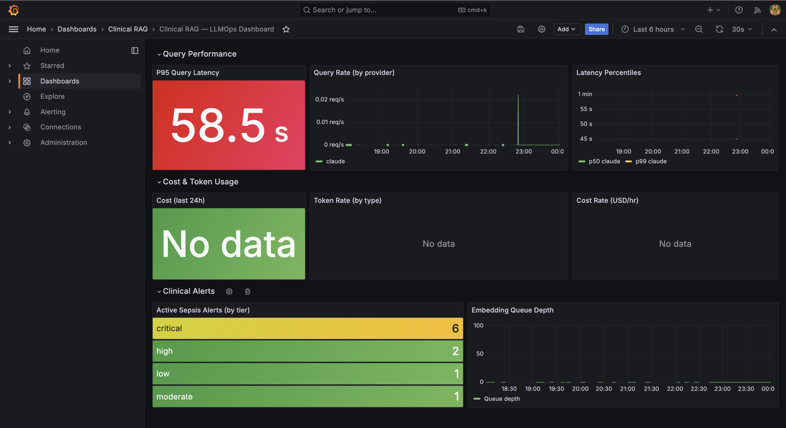

# Clinical RAG Pipeline — Healthcare LLM + ICU Risk Scoring

End-to-end clinical AI system that ingests real ICU patient data, computes hourly SOFA sepsis risk scores across 11,482 time windows, and uses Claude/GPT-4o to generate structured clinical assessments.


## Dashboard



*Live monitoring: P95 latency by LLM provider, active sepsis alerts by risk tier, query rate, and embedding queue depth.*

## Stack
- Apache Spark 3.5.3 + Delta Lake 3.2.0 (Bronze/Silver/Gold medallion)
- FastAPI + pgvector (Postgres 16, HNSW indexing)
- Claude claude-opus-4-6 / GPT-4o (switchable via config)
- Apache Airflow 2.9.1 orchestration
- Prometheus + Grafana LLMOps monitoring
- Docker Compose (9 services)
- MIMIC-III Clinical Database

## Results on MIMIC-III Demo (100 patients)
- 758,355 raw chart events ingested
- 55,548 hourly vital sign windows
- 11,482 SOFA-scored time windows
- 6,317 critical-tier risk assessments (SOFA >= 13)

## Quick Start
```bash
git clone https://github.com/YOUR_USERNAME/clinical-rag-pipeline
cd clinical-rag-pipeline
cp .env.example .env  # add your ANTHROPIC_API_KEY
docker compose up -d
```

## Services
| Service | URL |
|---|---|
| API Docs | http://localhost:8000/docs |
| Grafana | http://localhost:3000 |
| Airflow | http://localhost:8082 |
| Spark UI | http://localhost:8080 |

## Data
Uses MIMIC-III Clinical Database Demo (PhysioNet). Do not commit CSV files.

## License
MIT

## Known Issues & TODOs

- **NOTEEVENTS empty in demo**: The MIMIC-III demo dataset has no clinical notes, so pgvector embeddings and RAG retrieval run without supporting context. The full MIMIC-III dataset (requires PhysioNet credentialing) has 2M+ notes.
- **First run is slow**: spark-submit downloads Delta Lake JARs (~200MB) on first run. Subsequent runs use the Ivy cache.
- **Silver OOM on low memory**: If Docker has less than 6GB allocated, the silver transform will be killed during CHARTEVENTS processing. Fix: increase Docker memory in Settings > Resources.
- **TODO**: Add unit tests for SOFA sub-score calculations
- **TODO**: Load gold SOFA scores back into Postgres automatically via Airflow
- **TODO**: Add patient timeline view to API response
